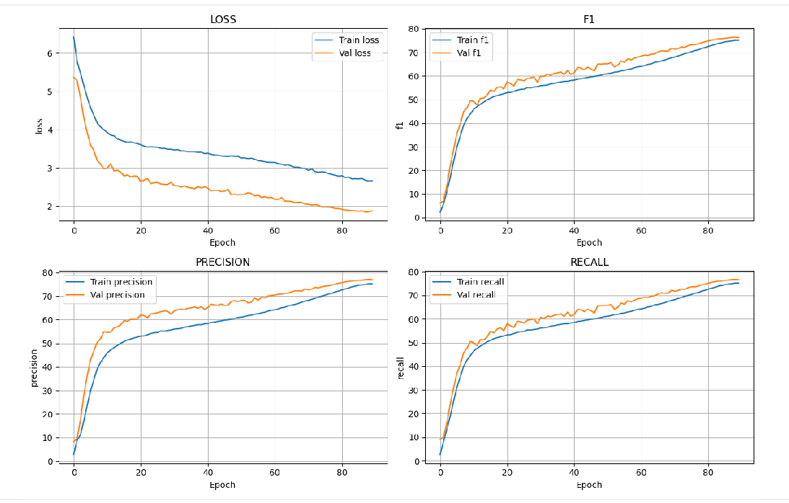
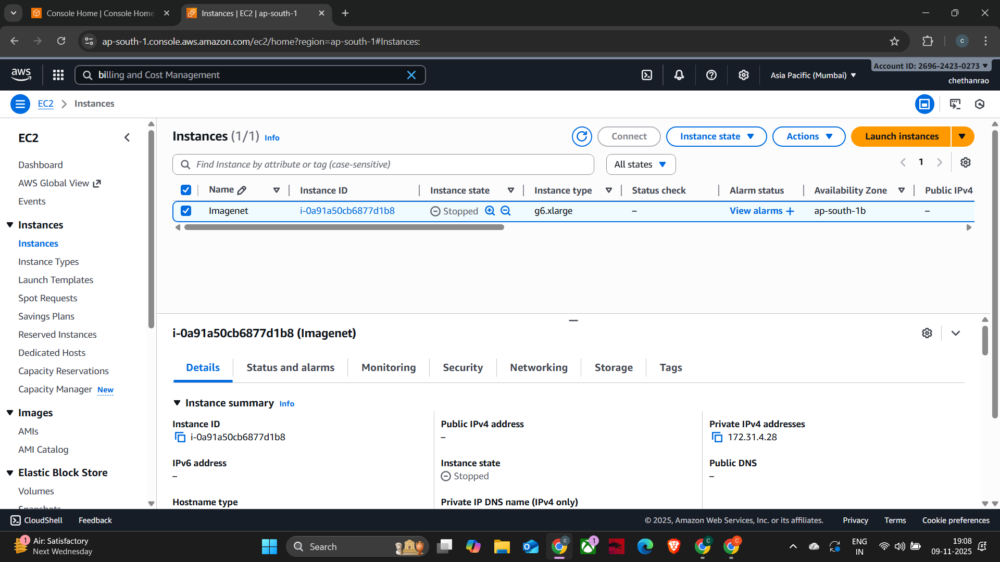
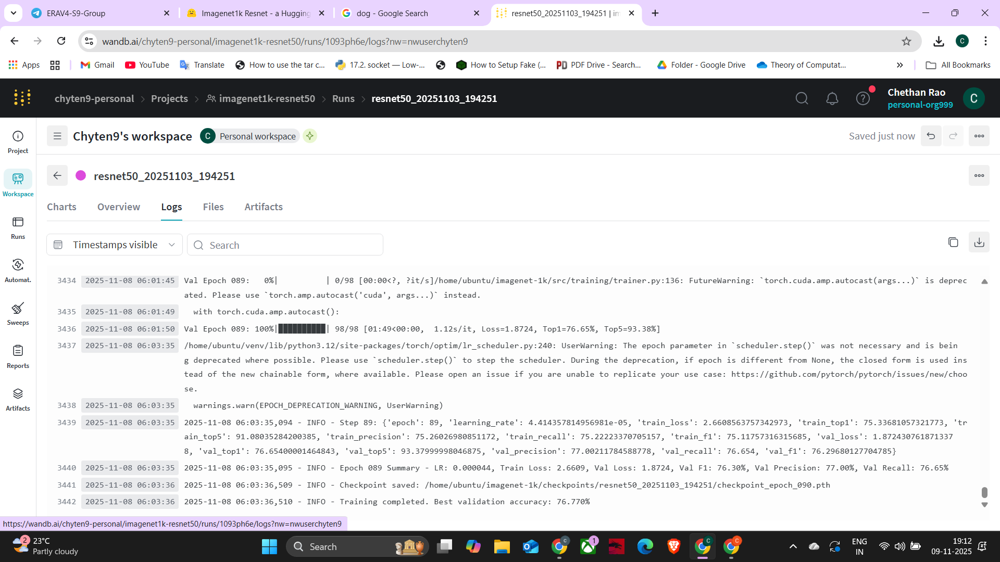

# ImageNet Training with ResNet

A comprehensive PyTorch implementation for training ResNet models on ImageNet-1K and ImageNet-100K datasets with modern training techniques and best practices.

## Training & Validation Accuracy

| Metric        | Accuracy (%) |
|---------------|--------------|
| **Training**   | 75.33        |
| **Validation** | 76.77        |


📄 **Source:** [`metrics.md`](./metrics.md)

## Features

- **ResNet Architecture**: ResNet- 50
- **Dataset Support**: ImageNet-1K (full)
- **Advanced Training Techniques**:
  - Label Smoothing
  - Mixup and CutMix augmentations
  - AutoAugment
  - Drop Path (Stochastic Depth)
  - Automatic Mixed Precision (AMP)
  - torch.compile support
- **Optimizers**: SGD, Adam, AdamW with proper weight decay
- **Schedulers**: Cosine Annealing, Step, MultiStep with warmup
- **Logging**: WandB integration and local logging
- **Modular Design**: Clean, extensible codebase

## Requirements

```bash
pip install -r requirements.txt
```

## Project Structure

```
imagenet/
├── configs/
│   └── config.yaml          # Training configuration
├── src/
│   ├── data/
│   │   ├── __init__.py
│   │   └── dataset.py       # Data loading and augmentations
│   ├── models/
│   │   ├── __init__.py
│   │   └── resnet.py        # ResNet implementations
│   ├── utils/
│   │   ├── __init__.py
│   │   ├── losses.py        # Loss functions
│   │   ├── optimizers.py    # Optimizers and schedulers
│   │   ├── metrics.py       # Accuracy metrics
│   │   └── logger.py        # Logging utilities
│   └── training/
│       ├── __init__.py
│       └── trainer.py       # Training loop
├── logs/                    # Training logs and checkpoints
├── train.py                 # Training script
├── evaluate.py              # Evaluation script
├── requirements.txt         # Dependencies
└── README.md               # This file
```

## Setup

1. **Create and activate virtual environment**:
```bash
python3 -m venv .venv
source venv/bin/activate
```

2. **Install dependencies**:
```bash
pip install -r requirements.txt
```

3. **Prepare dataset**:
   - Download ImageNet dataset
   - Organize in the following structure:
   ```
   /path/to/imagenet/
   ├── train/
   │   ├── n01440764/
   │   ├── n01443537/
   │   └── ...
   └── val/
       ├── n01440764/
       ├── n01443537/
       └── ...
   ```

## Usage

### Training

**Basic training**:
```bash
python train.py --config configs/config.yaml --data-path /path/to/imagenet

python train.py --config configs/config.yaml  
```

**Training with custom parameters**:
```bash
python train.py \
    --config configs/config.yaml \
    --data-path /path/to/imagenet \
    --dataset imagenet1k \
    --model resnet50 \
    --batch-size 256 \
    --lr 0.1 \
    --epochs 90
```

**Resume training**:
```bash
python train.py --config configs/config.yaml --resume logs/run_name/checkpoints/checkpoint_epoch_030.pth
```

### Evaluation

```bash
python evaluate.py \
    --config configs/config.yaml \
    --checkpoint logs/run_name/checkpoints/best_model.pth \
    --data-path /path/to/imagenet
```

## Configuration

Edit `configs/config.yaml` to customize training parameters:

```yaml
model:
  name: "resnet50"          # resnet18, resnet34, resnet50, resnet101, resnet152
  num_classes: 1000

data:
  dataset: "imagenet1k"     # imagenet1k or imagenet100k
  data_path: "/path/to/imagenet"
  batch_size: 256
  num_workers: 8

training:
  epochs: 90
  lr: 0.1
  label_smoothing: 0.1      # 0.0 to disable
  mixup_alpha: 0.2          # 0.0 to disable
  cutmix_alpha: 1.0         # 0.0 to disable

optimizer:
  name: "sgd"               # sgd, adam, adamw
  momentum: 0.9
  weight_decay: 1e-4
  nesterov: true

scheduler:
  name: "cosine"            # cosine, step, multistep
  warmup_epochs: 5
  warmup_lr: 1e-6
  min_lr: 1e-5
```

## Training screenshots







## Hugging Face inference

Live demo: https://huggingface.co/spaces/rraghu214/imagenet1k-resnet


## Key Features for High Accuracy

1. **Label Smoothing**: Reduces overfitting and improves generalization
2. **Mixup/CutMix**: Data augmentation techniques for better regularization
3. **Cosine Annealing**: Better learning rate scheduling
4. **Warmup**: Gradual learning rate increase at the beginning
5. **Weight Decay**: Proper L2 regularization
6. **AutoAugment**: Advanced data augmentation policies
7. **Drop Path**: Stochastic depth for better regularization
8. **AMP**: Faster training with mixed precision

## Logging

- **Local logs**: Saved in `logs/` directory with timestamps
- **WandB**: Real-time monitoring and experiment tracking
- **Checkpoints**: Automatic saving of best models and regular intervals

## Hardware Requirements

- **GPU**: CUDA-capable GPU with at least 8GB memory for batch size 256
- **RAM**: At least 32GB for efficient data loading
- **Storage**: SSD recommended for faster data loading

## Tips for Best Results

1. **Batch Size**: Use the largest batch size that fits in memory
2. **Learning Rate**: Scale with batch size (lr = base_lr * batch_size / 256)
3. **Data Loading**: Use sufficient workers (`num_workers = 4 * num_gpus`)
4. **Preprocessing**: Keep ImageNet normalization values
5. **Validation**: Monitor validation accuracy to prevent overfitting

## Troubleshooting

1. **Out of Memory**: Reduce batch size or enable AMP
2. **Slow Training**: Increase num_workers, use SSD, enable pin_memory
3. **Poor Accuracy**: Check data preprocessing, learning rate, and augmentations
4. **NaN Loss**: Reduce learning rate or disable AMP

## License

This project is licensed under the MIT License.